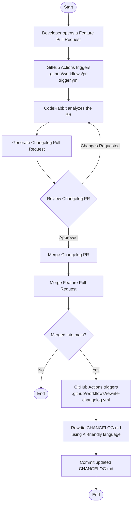

# changelog-generator

- POC to apply strategy to generate the changelog

## Architecture flow

### Step by step flow explained

1. A developer opens a **Feature Pull Request**.
2. The **`pr-trigger.yml`** GitHub Actions workflow starts automatically.
3. **CodeRabbit** analyzes the feature PR and generates a dedicated **Changelog PR**.
4. The generated Changelog PR is reviewed and approved.
5. After approval, the Changelog PR is merged.
6. The original Feature PR is then merged.
7. If the Feature PR is merged into the **`main`** branch, GitHub Actions triggers **`rewrite-changelog.yml`**.
8. The workflow rewrites the technical changelog into a version that is understandable by **non-technical stakeholders** (such as product managers, executives, customer support, or end users).
9. The rewritten `CHANGELOG.md` is committed, completing the automation process.
